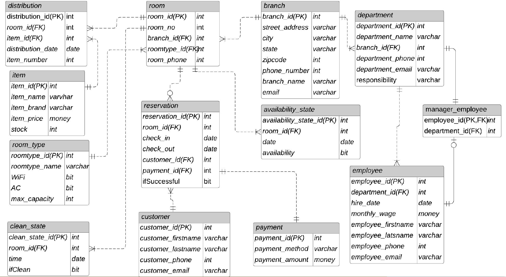
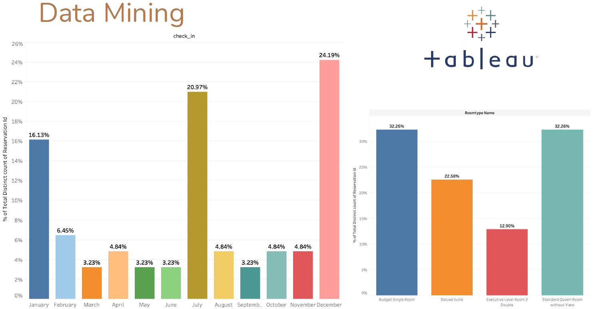

# Boba Hotel Database Management System

The hotel management database system is aimed at processing and maintaining essential data, supplying information and management service for hotel management.
				
- Tracking real-time availability of all rooms across different locations of the hotel chain.
- Keeping track of information of customers and transaction payments.
- Central management to prevent collision and boost efficiency in reservation.
- Supporting data across departments and employees to enhance service quality.

**Business Objective**

- Query and update real-time availability
- Query and update cleaning status of each room
- Query and update distribution of daily supplies
- Query payment details of transactions
- Query and update employee and department information
- Facilitate data mining and analytics in Tableau

**Code Structure**

- `create_tables.sql`: create a database and 13 tables
- `insert_data.sql`: insert data for 13 tables
- UDFs
  * `function_CheckWage.sql`: check whether a manager gets a reasonable wage
  * `function_checkAnnulSalary.sql`: calculate employee's annual salary 
  * `function_cost.sql`: calculate total cost per in-stock item as a new column
  * `function_ getTotalPayments.sql`: calculate total payment amount by CustomerID
- Views
  * `view_vwBookedRoom.sql`: create a view to show information of all booked rooms
  * `view_ vwBranchRoomInformation.sql`: create a view to see all kinds of rooms in a specific branch
  * `view_vwManagerInformation.sql`: create a view to show information of managers

**Database Design**

**Data Visualization in Tableau**

